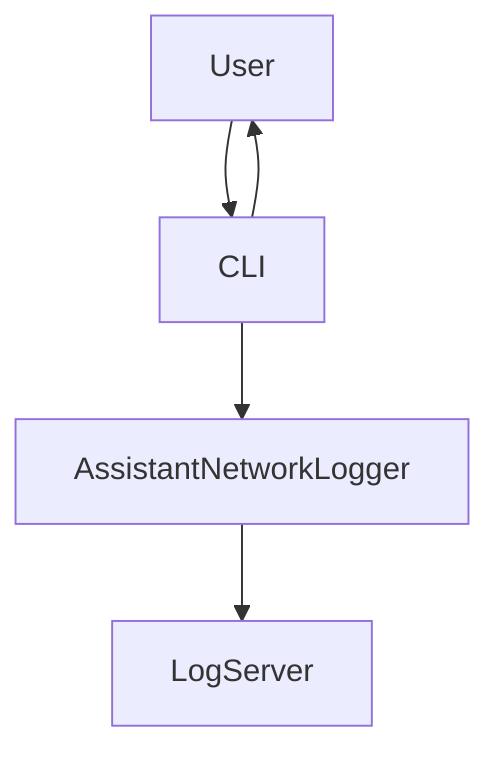

# Assistant Logging System

A Python-based centralized logging system for assistant applications.
Supports UDP log transmission, structured logging, and synchronous processing.

---

## Features

* **Centralized UDP logging**: Send logs from multiple clients to a single server.
* **Structured JSON logs**: Includes timestamp, level, mode, message, and extra data.
* **Multiple modes**: "Q&A" and "Summarization".
* **Interactive CLI**: Switch modes and get real-time responses.

---

## Architecture Overview



* **CLI**: Interactive interface for user input.
* **SyncProcessor**: Processes input and generates responses.
* **AssistantNetworkLogger**: Sends logs to the central server.
* **Log Server**: Receives logs and prints them.

---

## Components

1. **ILogger** – Logging interface for all loggers.
2. **AssistantNetworkLogger** – Sends logs to the central server via UDP.
3. **SyncProcessor** – Handles user requests and logs interactions.
4. **Central Log Server** – Receives and displays log messages.
5. **CLI Application** – Interactive terminal app with commands:

   * `/qa` → Q&A mode
   * `/summarizer` → Summarization mode
   * `/exit` → Quit

---

## Example Session

```
[Q&A] You: What is Python?
Assistant: Q&A response: What is Python?

[Summarization] You: Summarize this text...
Assistant: Summarized content: Summarize this text...
```

---

## Requirements

* Python 3.8+
* No external dependencies

---

## Running the System

1. Start the central log server:

```bash
python log_center.py
```

2. Run the CLI application:

```bash
python main.py
```

---

## Notes

* UDP is **fire-and-forget**, so logs are not guaranteed to arrive.
* Extendable: Implement `ILogger` to add new logging backends.

---
